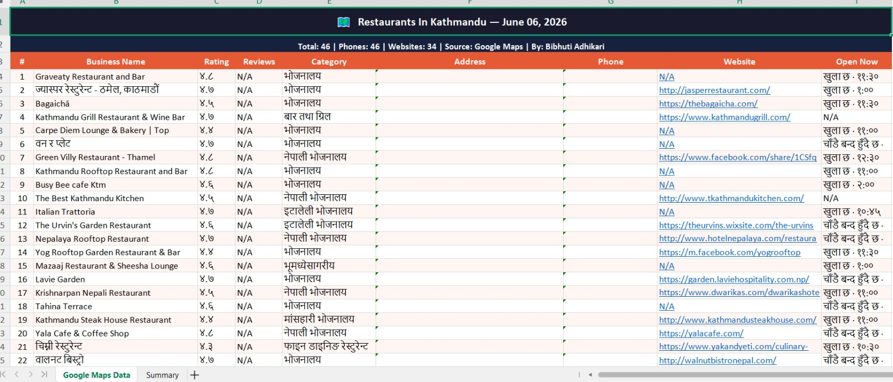

# 🗺️ Google Maps Scraper

Python + Playwright scraper that extracts business 
data from Google Maps and exports to Excel.

## 📸 Output Preview


## 📊 Data Collected
- Business Name
- Rating & Reviews
- Category
- Address
- Phone Number
- Website
- Open/Closed Status

## 🛠️ Technologies
- Python 3
- Playwright
- OpenPyXL

## ▶️ How to Run
```bash
pip install playwright openpyxl
playwright install chromium
python scraper.py
```

## 🔎 Change Search Query
```python
SEARCH_QUERY = "restaurants in Kathmandu"
MAX_RESULTS  = 50
```

## 👤 Author
Bibhuti Adhikari — [bibhutiportfolio.vercel.app](https://bibhutiportfolio.vercel.app)

[](https://fiverr.com/bibhuti981)
